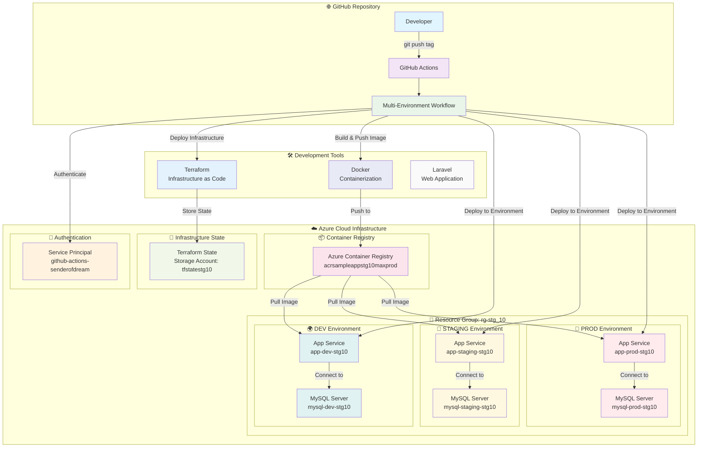
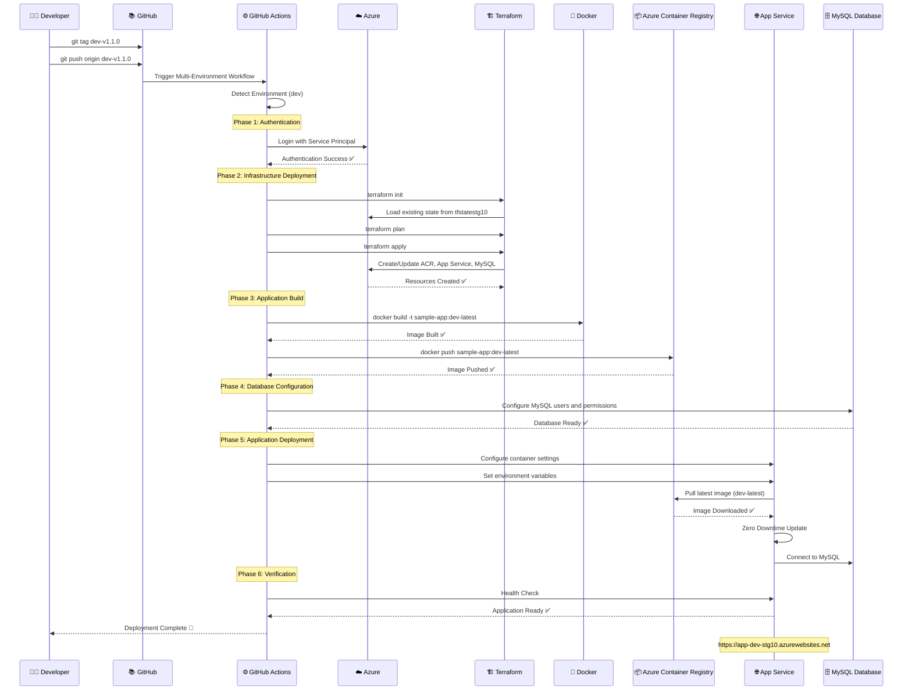
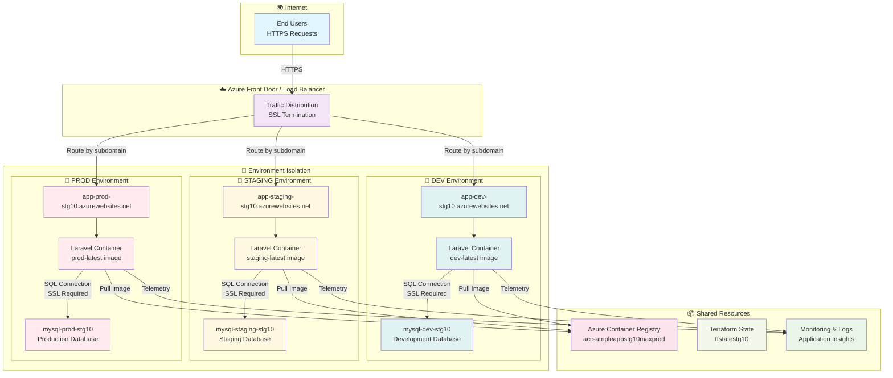
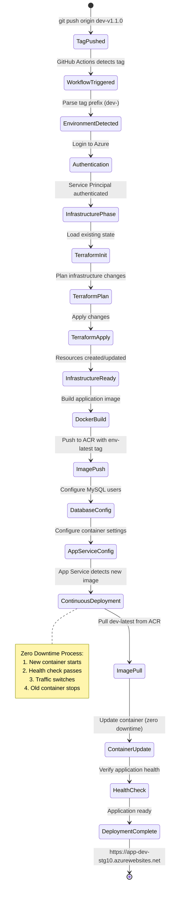

# 🏗️ Architecture Diagrams - T-CLO-901 Multi-Environment Deployment

## 📊 **1. Architecture Globale du Système**

## 🔄 **2. Workflow de Déploiement Multi-Environnement**

## 🏗️ **3. Architecture Technique Détaillée**

```mermaid
graph LR
    subgraph "💻 Development Environment"
        A1[Laravel Application<br/>PHP 8.2 + Apache]
        A2[Docker Container<br/>Multi-stage Build]
        A3[Terraform Modules<br/>Infrastructure Definition]
    end
    
    subgraph "🔄 CI/CD Pipeline"
        B1[GitHub Actions<br/>Multi-Environment Workflow]
        B2[Environment Detection<br/>Tag-based Routing]
        B3[Parallel Execution<br/>Build + Infrastructure]
    end
    
    subgraph "☁️ Azure Infrastructure"
        subgraph "🔐 Security Layer"
            C1[Service Principal<br/>RBAC Authentication]
            C2[Key Vault<br/>Secrets Management]
            C3[SSL/TLS Certificates<br/>DigiCert Global Root CA]
        end
        
        subgraph "📦 Container Platform"
            D1[Azure Container Registry<br/>Docker Image Storage]
            D2[App Service Linux<br/>Container Hosting]
            D3[Continuous Deployment<br/>Image Auto-Update]
        end
        
        subgraph "🗄️ Data Layer"
            E1[MySQL Flexible Server<br/>SSL Required]
            E2[Database Per Environment<br/>app_database]
            E3[Automated Migrations<br/>Laravel Artisan]
        end
        
        subgraph "🌐 Network Layer"
            F1[Virtual Network<br/>Secure Communication]
            F2[Private Endpoints<br/>Database Access]
            F3[Load Balancer<br/>High Availability]
        end
        
        subgraph "📊 Monitoring Layer"
            G1[Application Insights<br/>Performance Monitoring]
            G2[Log Analytics<br/>Centralized Logging]
            G3[Health Checks<br/>Availability Monitoring]
        end
    end
    
    A1 --> A2
    A2 --> B1
    A3 --> B1
    B1 --> B2
    B2 --> B3
    B3 --> C1
    C1 --> D1
    D1 --> D2
    D2 --> D3
    B3 --> E1
    E1 --> E2
    E2 --> E3
    D2 --> F1
    F1 --> F2
    F2 --> F3
    D2 --> G1
    G1 --> G2
    G2 --> G3
    
    style A1 fill:#e3f2fd
    style A2 fill:#e8eaf6
    style A3 fill:#f3e5f5
    style B1 fill:#e8f5e8
    style B2 fill:#fff3e0
    style B3 fill:#fce4ec
    style C1 fill:#ffebee
    style C2 fill:#f1f8e9
    style C3 fill:#e0f2f1
    style D1 fill:#fff8e1
    style D2 fill:#e1f5fe
    style D3 fill:#fafafa
```

## 🔄 **4. Flux de Données et Communication**

## 🚀 **5. Processus de Déploiement Zero Downtime**

## 📋 **6. Technologies et Versions**

| Composant | Technologie | Version | Rôle |
|-----------|-------------|---------|------|
| **Application** | Laravel | 10.x | Framework PHP |
| **Runtime** | PHP | 8.2.8 | Langage de programmation |
| **Web Server** | Apache | 2.4 | Serveur HTTP |
| **Containerization** | Docker | Latest | Containerisation |
| **Container Registry** | Azure Container Registry | - | Stockage d'images |
| **Hosting** | Azure App Service Linux | - | Hébergement de conteneurs |
| **Database** | MySQL Flexible Server | 8.0 | Base de données |
| **Infrastructure** | Terraform | 1.9.8 | Infrastructure as Code |
| **CI/CD** | GitHub Actions | - | Intégration continue |
| **Monitoring** | Application Insights | - | Observabilité |
| **SSL/TLS** | DigiCert Global Root CA | - | Sécurité |

## 🎯 **7. Avantages de l'Architecture**

### **🔄 DevOps Excellence**
- ✅ **Infrastructure as Code** : Reproductibilité complète
- ✅ **CI/CD Automatisé** : Déploiement par tags Git
- ✅ **Multi-environnement** : Isolation dev/staging/prod
- ✅ **Zero Downtime** : Mise à jour sans interruption

### **☁️ Cloud Native**
- ✅ **Containerisation** : Portabilité et scalabilité
- ✅ **Managed Services** : Réduction de la maintenance
- ✅ **Auto-scaling** : Adaptation automatique à la charge
- ✅ **High Availability** : Redondance et résilience

### **🔐 Sécurité**
- ✅ **RBAC** : Contrôle d'accès basé sur les rôles
- ✅ **SSL/TLS** : Chiffrement des communications
- ✅ **Secrets Management** : Gestion sécurisée des credentials
- ✅ **Network Isolation** : Segmentation réseau

### **📊 Observabilité**
- ✅ **Monitoring** : Surveillance en temps réel
- ✅ **Logging** : Centralisation des logs
- ✅ **Alerting** : Notifications automatiques
- ✅ **Performance Tracking** : Métriques applicatives

---

## 🏆 **Conclusion**

Cette architecture représente un **système DevOps de niveau professionnel** pour le projet **T-CLO-901 Epitech**, démontrant :

- **Maîtrise technique** : Technologies cloud modernes
- **Bonnes pratiques** : DevOps, sécurité, monitoring
- **Scalabilité** : Architecture extensible
- **Fiabilité** : Déploiement zero downtime

**Un projet exemplaire qui illustre parfaitement les compétences DevOps attendues ! 🎓🚀**
